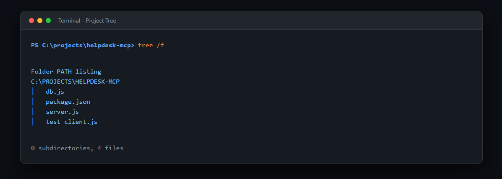
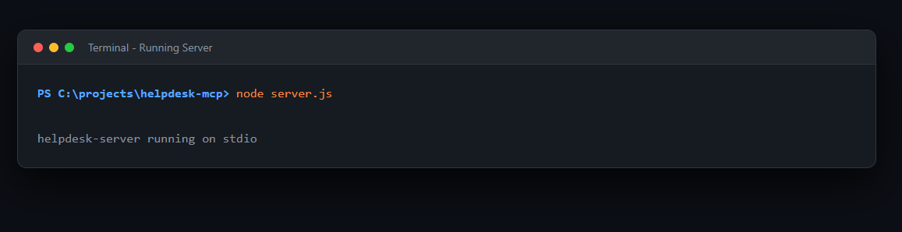
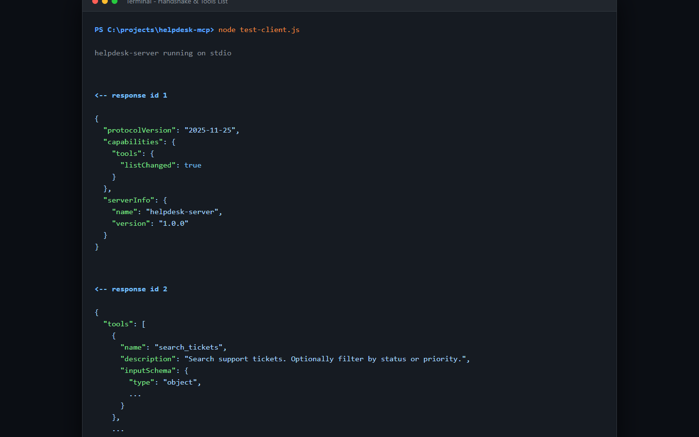
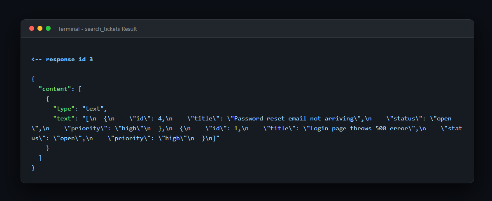
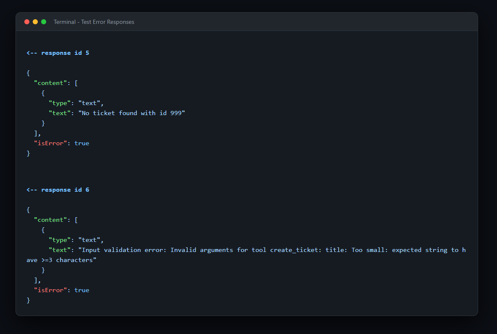
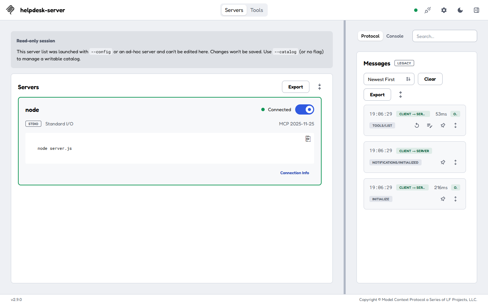
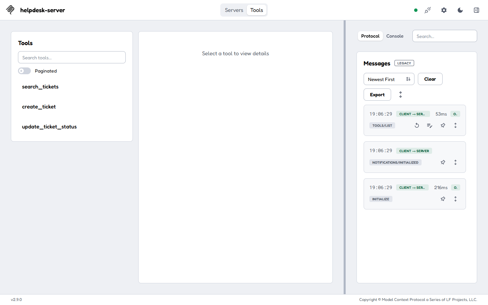
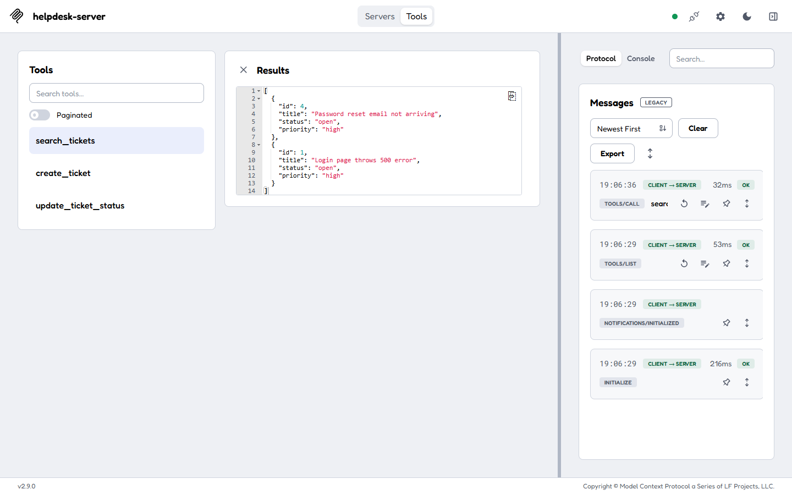
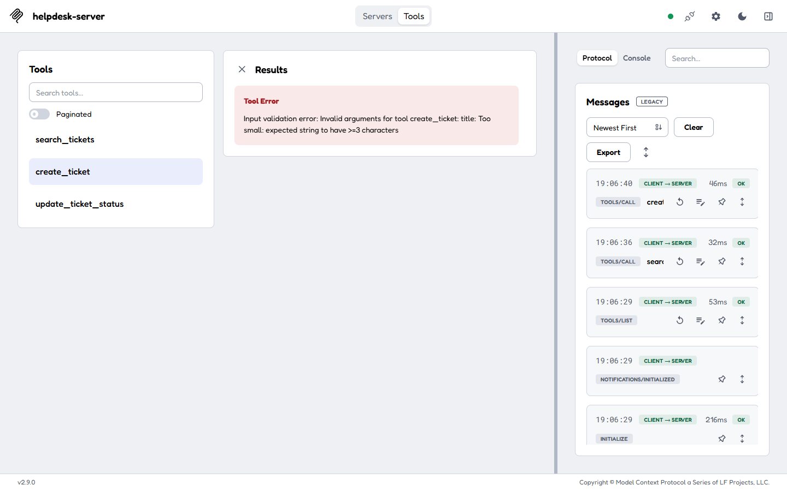

# Helpdesk MCP Server

A demo **Model Context Protocol (MCP)** server in Node.js, built with the v2 TypeScript SDK. It exposes a SQLite-backed support-ticket system so AI applications can search tickets, create tickets, and update ticket statuses.

---

## Tech Stack

- **Runtime:** Node.js 20+ (ES modules, `"type": "module"`)
- **MCP Server SDK:** `@modelcontextprotocol/server` v2.x
- **Schema validation:** Zod v4 (`zod/v4`)
- **Database:** `better-sqlite3` (SQLite)
- **Transport:** stdio (`StdioServerTransport`)
- **Dev tooling:** `@modelcontextprotocol/inspector` v2

---

## Requirements

- Node.js 20 or newer
- npm

---

## Project Structure

```text
helpdesk-mcp-server/
├── db.js                 # Database setup and initial seeding (4 tickets)
├── server.js             # MCP server setup and tool definitions
├── test-client.js        # stdio JSON-RPC test client
├── package.json          # Dependencies and project settings
├── package-lock.json     # Locked dependency versions
├── README.md             # This file
├── .gitignore            # Excludes node_modules and helpdesk.db
└── screenshots/          # Output screenshots used in the article
```

---

## Quick Start

### 1. Install

```bash
git clone https://github.com/Sarthakshahvnsgu/helpdesk-mcp-server.git
cd helpdesk-mcp-server
npm install
```

### 2. Run the automated test client

The test client starts the server, performs the MCP handshake, lists the tools, and calls each one, including the error cases.

```bash
node test-client.js
```

Expected results:

| Response id | What it checks | Result |
| :--- | :--- | :--- |
| 1 | Handshake | Server name `helpdesk-server`, tools capability |
| 2 | Tool discovery | `search_tickets`, `create_ticket`, `update_ticket_status` |
| 3 | Read tool | Two open, high-priority tickets |
| 4 | Write tool | `Created ticket #5` |
| 5 | Error handling | `No ticket found with id 999` (`isError: true`) |
| 6 | Validation | Title too short is rejected before the handler runs |

Responses can arrive out of order, because MCP matches each response to its request by id.

### 3. Explore with the MCP Inspector

```bash
npx mcp-inspector node server.js
```

Open the full URL printed in the terminal, **including the token** at the end (for example `http://127.0.0.1:6274?MCP_INSPECTOR_API_TOKEN=...`). Opening `localhost` without the token causes a proxy authentication error.

In the Inspector, use transport **STDIO**, command `node`, and arguments `server.js`, then click Connect.

---

## Tools Reference

The server registers three tools with `server.registerTool()`.

### 1. `search_tickets` (read-only)

- **Description:** Search support tickets, optionally filtered by status or priority.
- **Annotations:** `{ readOnlyHint: true }`
- **Input:**
  - `status`: optional, one of `open`, `in_progress`, `closed`
  - `priority`: optional, one of `low`, `medium`, `high`
  - `limit`: optional integer, 1 to 50, default 10

### 2. `create_ticket` (write)

- **Description:** Create a new support ticket.
- **Input:**
  - `title`: string, 3 to 120 characters
  - `priority`: one of `low`, `medium`, `high`, default `medium`

### 3. `update_ticket_status` (write)

- **Description:** Change the status of an existing ticket.
- **Input:**
  - `id`: positive integer
  - `status`: one of `open`, `in_progress`, `closed`
- **Errors:** Returns `isError: true` with a readable message if no ticket matches the id.

---

## Screenshots

| Feature | Screenshot |
| :--- | :--- |
| Project structure |  |
| Server running on stdio |  |
| Handshake and tool list |  |
| Search result |  |
| Error handling |  |
| Inspector connected |  |
| Inspector tool list |  |
| Running a tool in the Inspector |  |
| Zod validation error |  |

---

## Security and Logging Notes

- **stdout is reserved for protocol messages.** In a stdio MCP server, a stray `console.log` corrupts the JSON-RPC stream. All diagnostics use `console.error()`.
- **Inputs are validated before the handler runs.** Zod schemas use enums, length limits and numeric bounds.
- **Queries are parameterized.** Model-provided values are never concatenated into SQL.
- **`readOnlyHint` is a hint, not enforcement.** It informs the host application but does not restrict anything. Real restrictions belong in code and database permissions.
- **Destructive actions need human approval** in any real deployment.
- **Tokens stay private.** The Inspector session token is generated at startup and must not appear in screenshots or commits.

---

## Notes

- `helpdesk.db` is created automatically on first run and seeded with 4 tickets. It is excluded from Git.
- You normally don't run `node server.js` by hand. An MCP client, such as `test-client.js` or the Inspector, launches it over stdio.
- This is a learning project. It has no authentication, so don't expose it to the internet as it is.

---

## Article

Read the full walkthrough on Medium: (https://medium.com/@sendtosarthak/your-backend-has-a-ui-for-humans-heres-how-to-build-one-for-ai-236f72e3435d)

---

## License

ISC